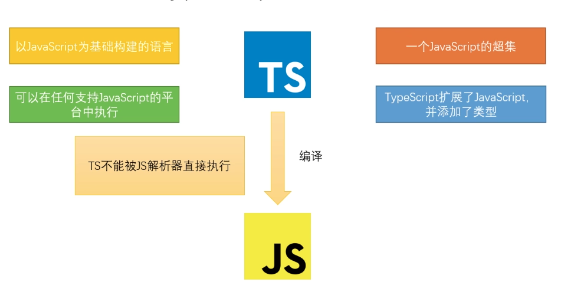

## TypeScript
### 背景
JS的缺点：动态类型
from：微软设计的

### 定义

以JavaScript为基础构建的语言，是JavaScript的**超集**
- 可以在任何支持JavaScript的平台中执行
- TypeScript扩展了Javascript、并添加了类型
  
> 注意：TS不能被JS解析器直接执行，需要把TS编译成JS文件（利用**TS解析器**）

### TS增加了什么
- 增加了一些新类型；
- 支持ES的新特性；
- 添加ES不具备的新特性
- 丰富的配置选项（ts可以编译成任何版本的js，兼容）
- 强大的开发工具（VSCode提示）

### 环境搭建
TS解析器：是用node编写的，所以需要node

全局安装typescript，输入`tsc -v`看到版本，证明安装成功
```shell
npm i typescript -g

tsc -v
# Version 4.2.3
```

### 基本类型
#### 类型声明
通过类型声明可以指定以下的类型，指定类型后，变量只能储存某种类型的值
- 变量
- 函数入参
- 函数返回值

指定类型后，当为变量赋值时，TS编辑器会自动检查值是否符合类型声明，符合则赋值，不符合则报错

语法
```js
let 变量: 类型;

let 变量: 类型 = 值;

function fn(参数1: 类型, 参数2: 类型): 返回值类型{
    ...
}
```

#### 自动类型判断
- TS拥有自动的类型判断机制
- 当对变量的声明和赋值是同时进行的，TS编译器会自动判断变量的类型

```ts
// 声明一个变量a，同时指定它的类型为number
let a: number
// a的类型为number，在以后的使用过程中a的值只能是数字
a = 10
a = 33
// a = 'hello'; // 此行代码会报错，因为变量a的类型是number，不能赋值字符串

// 声明变量直接赋值
let b = ''
b = '124'
b = 'ee'

// 如果变量的声明跟赋值是同时进行的，TS可以自动对变量进行类型检测
let c = false

c = true
// c = '' // 报错

// 函数入参类型声明
function sum(a: number, b: number) {
    return a + b + 's'
}

// 函数返回值类型声明
function add(a: number, b: number): number {
    // return a + b + '' 报错
    return a + b
}

console.log(sum(124, 45))
```
#### 12种类型
| 类型    | 描述                           | 例子          |
| ------- | ------------------------------ | ------------- |
| number  | 任意数字                       | 1,-22,2.5     |
| string  | 任意字符串                     | '', 'hello'   |
| boolean | 布尔值true或者false            | true, false   |
| 字面量  | 限制变量的值就是该字面量的值   | 其本身        |
| any     | 任意类型                       | *             |
| unknown | 类型安全的any                  | *             |
| void    | 没有值（或undefined）          | undefined     |
| never   | 不能是任何值                   | 没有值        |
| object  | 任意的js对象                   | {name: 'abc'} |
| any     | 任意js数组                     | [1,2,3]       |
| tuple   | 元组，TS新增类型，固定长度数组 | [4,5]         |
| enum    | 枚举，TS新增类型               | enum(A,B)     |

```ts
// -----------------字面量----------------------
// 直接使用字面量进行类型声明，只能为10
let num: 10
// num = 11 报错
// 像是定义了一个常量
// 使用场景：结合联合类型
let sex: "male" | 'female'


// -----------------any----------------------
let d: any
d = 10
d = 'hello'
d = false
// 一个变量设置为any后相当于对该变量关闭了TS的类型检测
// 不建议使用any
// 声明变量不指定类型，且不给初始值，则TS解析器会自动判断为any（隐式的any）
let s: string = ''
s = d // 不会报错，d是any类型，可以赋值给任意类型变量，any不仅祸害自己，还祸害被赋值的


// -----------------unknown----------------------
let n: unknown
n = 10
n = 'hello'
n = false
let s2: string = ''
// s2 = n // 报错，unknown类型不能赋值给其他类型
// 解决办法
// 1、类型断言
s2 = n as string
s2 = <string>n
// 2、if判断
if (typeof n === 'string') {
    s2 = n
}


// -----------------void----------------------
// 通常用来指定函数无返回值
function fn(): void {

}


// -----------------never----------------------
// never表示永远不会返回结果，用的很少
// 表示函数执行不完，报错
function fn2(): never {
    throw Error('err')
}

// -----------------object----------------------
// object不常用，因为js语言里面对象的概念并没有限制类型，比如下面的{}和function () {}都是对象
let obj: object
obj = {}
obj = function () { }

let obj2: {}
obj2 = { name: 'jona' }
obj2 = function () { }

// {}用来指定对象中可以包含哪些属性
// 语法: {属性名: 属性类型, 属性名: 属性类型}；在属性名后面加上?, 表示属性是可选的
let obj3: { name: string, age?: number }
obj3 = { name: "jona" }

// 实现：必须有name属性，其他属性不做要求
// [propName: string]: any表示任意类型属性
// propName属性名，一定是string类型，属性类型可以自定义，这里为any
let obj4: { name: string, [propName: string]: any }
obj4 = { name: 'jona', age: '24', sex: '' }

// 设置函数结构的类型声明，语法：(形参: 类型, 形参: 类型, ...) => 返回值
let func: (a: number, b: number) => number
func = (num1, num2) => {
    return num1 + num2
}


// -----------------array----------------------
// 有两种语法，类型[]; Array<类型>
// 字符串数组
let strArr: string[]
strArr = ['1', '2', '3']
// 数字数组
let numArr: number[]
numArr = [1, 2, 3]
// 另一种语法
let numArr2: Array<number>
numArr2 = [1, 2, 3]


// -----------------tuple----------------------
// 元组就是固定长度的数组
// 语法：[类型, 类型, ...]
let h: [string, string]
h = ['hello', 'ts']


// -----------------enum----------------------
enum Gender {
    MALE = "男",
    FEMALE = "女"
}

let student: { name: string, gender: Gender }
student = {
    name: 'jona',
    gender: Gender.FEMALE
}
```
#### 联合类型
##### ｜
表示或者
```ts
let width: string | number
```
##### &
表示同时
```ts
let people: { name: string } & { age: number }
``` 

#### 注意点：

##### any跟unknown的区别
- unknown其实就是一个类型安全的any
- unknown类型的变量，不能直接复制给其他变量，而any可以直接复制给其他变量
- any，unknown都会对自身变量放弃检测，any还会对赋值的变量关闭；所以尽量用unknown


### 类型断言
可以用来告诉解析器变量的实际类型，有以下两种语法
```js
// 语法1
变量 as 类型
// 语法2
<类型>变量
 
s = n as string
s = <string>n
```

### ts配置文件
`tsconfig.json`文件，执行`tsc --init`可以生成

#### 配置项
**1、include**
- 定义希望被编译文件所在的目录
- 默认编译目录下所有的ts文件，即`**/*`
```json
{
    "include": [
        "src/**/*.ts",
        "src/**/*.tsx",
        "src/**/*.vue",
        "tests/**/*.ts",
        "tests/**/*.tsx"
    ]
}
```
**2、exclude**
- 定义不需要编译的目录
- 默认值`["node_modules", "bower_components", "jspm_packages"]`
```json
{
    "exclude": "node_modules"
}
```
**3、extends**
- 定义继承的配置文件
```js
// 当前配置文件中会自动包含config目录下base.json中的所有配置信息
{
    "extends": "./configs/base"
}
```
**4、files**
- 指定被编译的文件，同includes，includes是指定文件夹，files是指定文件
- 只需要编译很少的文件才用到

**5、compilerOptions**
- target
  用来指定ts被编译为ES的版本
- module
  
- 的

