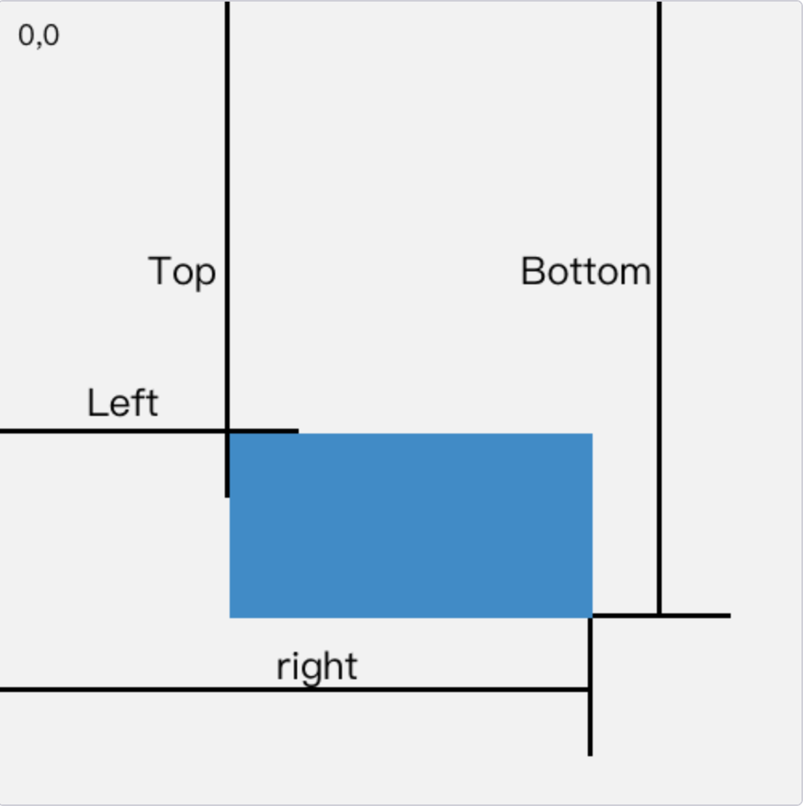
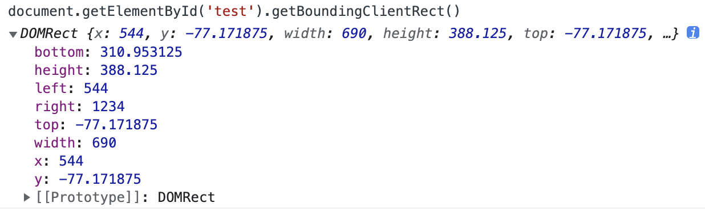

#### 定义：
懒加载就是将不关键的资源延后加载，提高首页渲染速度，按需加载，避免不必要的流量浪费

#### 原理：
懒加载的原理就是只加载自定义区域（通常是**可视区域**，但也可以是**即将进入可视区域**）内需要加载的东西

> 对于**图片**来说，先设置图片标签的 `src` 属性为一张占位图，将真实的图片资源放入一个自定义属性中(比如 `data-src` )，当进入自定义区域时，就将自定义属性替换为 `src` 属性，这样图片就会去下载资源，实现了图片懒加载
懒加载不仅可以用于图片，也可以使用在别的资源上，比如进入可视区域才开始播放视频等等

#### 图片懒加载实现方式
有三种实现方式：
##### （1）offsetTop-scroolTop<clientHeight

##### （2）Element.getBoundingClientRect(获取边界客户端矩形)
> [MDN](https://developer.mozilla.org/zh-CN/docs/Web/API/Element/getBoundingClientRect)：Element.getBoundingClientRect() 方法返回元素的大小及其相对于**视口**(视图窗口的左上角)的位置
如果是标准盒子模型，元素的尺寸等于width/height + padding + border-width的总和。如果box-sizing: border-box，元素的的尺寸等于 width/height




- **代码实现**
```js
// 
function isVisible(el) {
    const position = el.getBoundingClientRect()
    const windowHeight = document.documentElement.clientHeight
    const { top, bottom } = position
    // 顶部边缘可见
    const topVisible = top > 0 && top < windowHeight
    // 底部边缘可见
    const bottomVisible = bottom < windowHeight && bottom > 0
    return topVisible || bottomVisible
}

function imageLazyLoad() {
    const images = document.querySelectorAll('img')
    for (let img of images) {
        const realSrc = img.dataset.src
        if (!realSrc) continue
        if (isVisible(img)) {
            img.src = realSrc
            img.dataset.src = ''
        }
    }
}

// 测试
window.addEventListener('load', imageLazyLoad)
window.addEventListener('scroll', throttle(imageLazyLoad, 1000))
```
- **总结及问题**
    - 监听到 `scroll` 事件后，调用目标元素的 `getBoundingClientRect()` 方法，得到它对应于**视口左上角**的坐标，再判断是否在视口之内

    - 这种方法的缺点是，由于scroll事件密集发生，计算量很大，容易造成性能问题

##### （3）IntersectionObserver(交叉观察器)
> [MDN](https://developer.mozilla.org/zh-CN/docs/Web/API/IntersectionObserver): IntersectionObserver接口 (从属于Intersection Observer API) 提供了一种异步观察目标元素与其祖先元素或顶级文档视窗(viewport)交叉状态的方法。祖先元素与视窗(viewport)被称为根(root)

换句听得懂话说
> 可以自动"观察"元素是否可见，Chrome 51+ 已经支持。由于可见（visible）的本质是，目标元素与视口产生一个交叉区，所以这个 API 叫做"交叉观察器"
```js
// 接受两个参数：callback 是可见性变化时的回调函数，option 是配置对象（该参数可选）
// 目标元素的可见性变化时，就会调用观察器的回调函数 callback。callback 一般会触发两次。一次是目标元素刚刚进入视口（开始可见），另一次是完全离开视口（开始不可见）
var io = new IntersectionObserver((entries) => {
    // entries是一个数组，每个成员都是一个 IntersectionObserverEntry 对象
    console.log(entries)
}, option)

// 开始观察
io.observe(document.getElementById('example'))

// 停止观察
io.unobserve(element)

// 关闭观察器
io.disconnect()
```

- 阮一峰：https://www.ruanyifeng.com/blog/2016/11/intersectionobserver_api.html